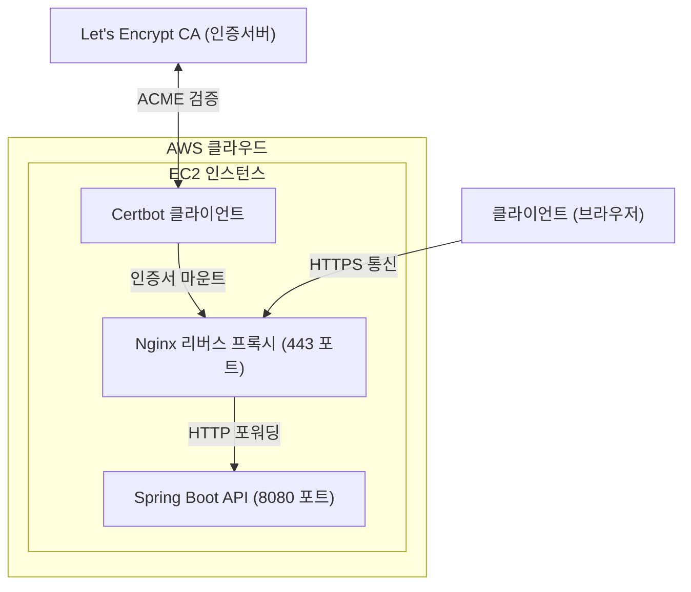
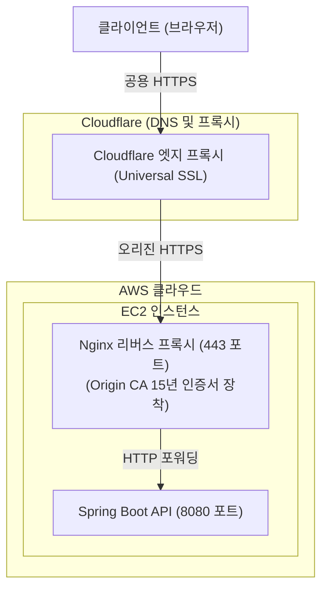
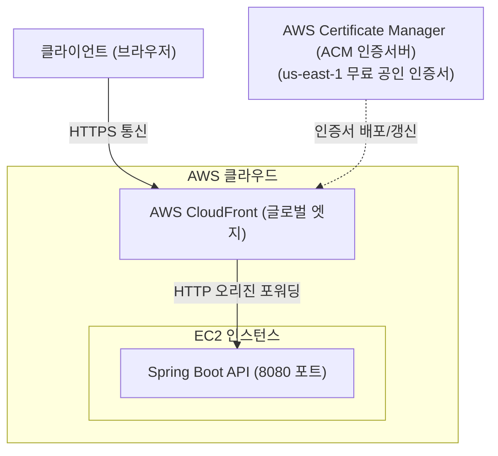
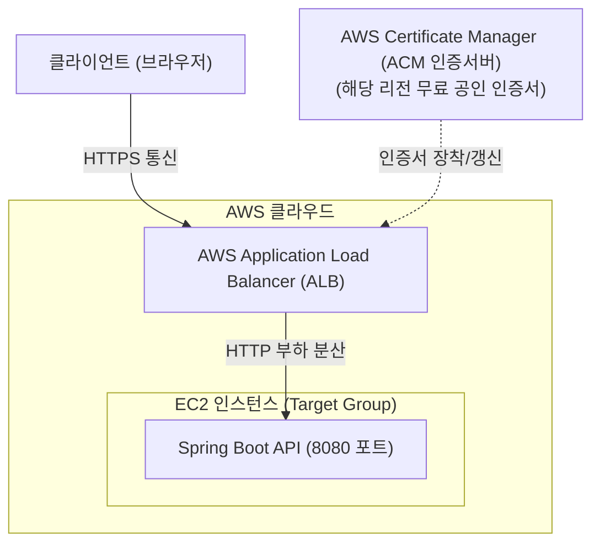

# 4장 프로젝트 심화 자율 과제

## 목차
- [1. 심화 자율 과제의 목적 및 개요](#1-심화-자율-과제의-목적-및-개요)
  - [1.1 과제 도입 배경](#11-과제-도입-배경)
  - [1.2 핵심 역량 및 수행 원칙](#12-핵심-역량-및-수행-원칙)
- [2. 챌린지 1: 프론트엔드 배포 파이프라인 구축](#2-챌린지-1-프론트엔드-배포-파이프라인-구축)
  - [2.1 프론트엔드 배포 기술 옵션 검토](#21-프론트엔드-배포-기술-옵션-검토)
  - [2.2 환경 변수 및 네트워크 연동 규약](#22-환경-변수-및-네트워크-연동-규약)
  - [2.3 필수 요구 조건 및 기존 산출물 연계](#23-필수-요구-조건-및-기존-산출물-연계)
- [3. 챌린지 2: 서드파티 결제 시스템(PG) 연동](#3-챌린지-2-서드파티-결제-시스템pg-연동)
  - [3.1 결제 솔루션 옵션 검토](#31-결제-솔루션-옵션-검토)
  - [3.2 결제 무결성 보장 프로세스](#32-결제-무결성-보장-프로세스)
  - [3.3 위변조 방지 및 트랜잭션 예외 처리](#33-위변조-방지-및-트랜잭션-예외-처리)
  - [3.4 필수 요구 조건 및 기존 산출물 연계](#34-필수-요구-조건-및-기존-산출물-연계)
- [4. 챌린지 3: 백엔드 API 서버 HTTPS 적용 및 SSL/TLS 인증서 구축](#4-챌린지-3-백엔드-api-서버-https-적용-및-ssltls-인증서-구축)
  - [4.1 HTTPS 적용의 필요성 및 배경](#41-https-적용의-필요성-및-배경)
  - [4.2 도메인 확보 및 DNS 연결 옵션 검토](#42-도메인-확보-및-dns-연결-옵션-검토)
  - [4.3 SSL/TLS 인증서 발급 및 적용 기술 옵션 검토](#43-ssltls-인증서-발급-및-적용-기술-옵션-검토)
  - [4.4 아키텍처별 HTTPS 구성 방식](#44-아키텍처별-https-구성-방식)
  - [4.5 필수 요구 조건 및 기존 산출물 연계](#45-필수-요구-조건-및-기존-산출물-연계)
- [5. 기술적 의사결정 기록 및 평가 기준](#5-기술적-의사결정-기록-및-평가-기준)
  - [5.1 의사결정 기록서(ADR) 작성 가이드](#51-의사결정-기록서adr-작성-가이드)
  - [5.2 최종 발표 및 평가 포인트](#52-최종-발표-및-평가-포인트)

---

# 1. 심화 자율 과제의 목적 및 개요

## 1.1 과제 도입 배경
- 본 프로젝트의 기본 백엔드 API 및 핵심 CI/CD 파이프라인은 공통 교안을 통해 완성하도록 설계.
- 실무 개발 현장에서는 정해진 가이드만을 따르지 않고, 공식 문서를 직접 분석하여 서비스 요구사항과 인프라 예산에 가장 적합한 기술 스택을 팀 단위로 검토 및 도입하는 역량이 필수적.
- 따라서 프론트엔드 배포 파이프라인과 서드파티 결제 연동의 두 영역은 각 팀이 주도적으로 기술적 의사결정(Tech Choice)을 수행하는 자율 탐구 챌린지로 운영.

## 1.2 핵심 역량 및 수행 원칙
- 공식 기술 문서 분석 능력: 외부 서비스의 최신 SDK 및 API 공식 문서를 직접 독해하고 시스템에 적용하는 역량 체득.
- 기술적 의사결정 타당성(Rationale) 확보: 특정 기술을 도입할 때 단순한 인지도나 편의성을 넘어 아키텍처적 장단점을 비교 분석하여 선택.
- 데이터 무결성 및 보안 준수: 클라이언트 환경의 한계를 인지하고 백엔드 중심의 데이터 유효성 검증 체계 확립.

---

# 2. 챌린지 1: 프론트엔드 배포 파이프라인 구축

## 2.1 프론트엔드 배포 기술 옵션 검토
각 팀의 클라이언트 애플리케이션 구조(React SPA)와 운영 예산에 부합하는 배포 방식을 자율적으로 선정하여 구축.

### 2.1.1 AWS S3 + CloudFront 정적 사이트 호스팅
- 구성 방식
  - 프론트엔드 빌드 결과물(HTML, CSS, JS 산출물)을 AWS S3 버킷에 업로드.
  - S3 앞단에 CloudFront(CDN)[^1]를 배치하여 글로벌 엣지 캐싱 및 SSL/TLS(HTTPS) 인증서 적용.
- 장점
  - 서버리스 기반으로 인프라 관리 부담이 없고 트래픽 증가에 따른 확장성 우수.
  - CloudFront 엣지 캐시를 통한 정적 리소스 로딩 속도 개선.
- 고려 사항
  - React Router와 같은 클라이언트 사이드 라우팅(CSR) 사용 시, 403/404 에러에 대해 `index.html`로 리다이렉트하는 오류 응답 페이지 규칙 설정 필요.
  - 신규 빌드 배포 시 CloudFront 캐시 무효화(Invalidation)[^2] 파이프라인 연계 필요.

### 2.1.2 Vercel / Netlify 플랫폼 연동
- 구성 방식
  - 프론트엔드 소스 코드 저장소(Git)와 호스팅 플랫폼을 연동하여 Git Push 시 자동 빌드 및 배포 수행.
- 장점
  - 설정 과정이 매우 단순하고, 브랜치별 프리뷰(Preview) 배포 환경 기본 제공.
  - 전 세계 분산 배포 및 SSL 자동 인증서 갱신 지원.
- 고려 사항
  - GitHub Organizations 무료 플랜 제약: Vercel 무료 티어는 조직 소속 레포지토리의 직접 연결을 지원하지 않아 개인 계정 Fork 등의 우회 파이프라인 필요.
  - 빌드 시간 및 동시성 한도: 무료 티어의 월간 빌드 시간(Netlify 기준 월 300분) 및 동시 빌드 1개 제한으로 인한 배포 대기열 발생 가능성 검토 필요.
  - 네트워크 대역폭 한도: 무료 제공량(월 100GB) 초과 시 서비스 접근 차단 위험 고려 필요.

### 2.1.3 Nginx 컨테이너 기반 호스팅 (Docker Compose 연계)
- 구성 방식
  - 프론트엔드 정적 산출물을 Nginx 웹 서버 이미지 내에 포함하여 컨테이너화.
  - 백엔드 EC2 인스턴스 내 Docker Compose 환경에서 백엔드 컨테이너와 함께 단일 네트워크로 구동.
- 장점
  - 추가적인 클라우드 호스팅 서비스 가입 없이 기존 EC2 인스턴스 자원 활용 가능.
  - Nginx 리버스 프록시 설정을 통해 동일 도메인/포트 환경에서 프론트와 백엔드 서빙 가능.
- 고려 사항
  - 프론트엔드 트래픽이 백엔드 호스트 서버의 리소스(CPU, 메모리, 네트워크 대역폭)를 공유하므로 서버 부하 분산 고려 필요.

## 2.2 환경 변수 및 네트워크 연동 규약

### 2.2.1 클라이언트 환경 변수 주입
- 빌드 시점에 백엔드 API 서버의 실제 엔드포인트 URL(`VITE_API_URL` 등)이 올바르게 번들링되도록 구성.
- 로컬 개발 환경(`localhost:8080`)과 실제 운영 배포 환경(EC2 퍼블릭 도메인) 간의 환경 변수 분리 설정.

### 2.2.2 CORS 및 혼합 콘텐츠(Mixed Content) 방지
- HTTPS가 적용된 프론트엔드 도메인에서 HTTP 백엔드 API를 호출할 경우 브라우저 보안 정책상 혼합 콘텐츠(Mixed Content)[^3] 에러가 발생하므로, 프로토콜 일치화(전체 HTTPS 적용) 또는 프록시 계층 설계 필요.
- 백엔드 Spring Security의 CORS 설정에 프론트엔드 배포 도메인을 등록하여 브라우저의 교차 출처 요청 허용.

## 2.3 필수 요구 조건 및 기존 산출물 연계
- 요구 조건
  - 팀원 누구나 접근 가능한 공개 웹 주소(URL)를 통해 메인 서비스가 정상 동작해야 함.
  - 코드 변경 사항 발생 시 수동 파일 전송 없이 자동화된 파이프라인(GitHub Actions 또는 Vercel / Netlify 플랫폼과 Git 연동)을 통해 재배포되어야 함.
- 기존 산출물 연계 가이드
  - 배포 아키텍처: docs/02_design/01_architecture.md의 프론트엔드 호스팅 영역에 팀이 선정한 배포 구성 다이어그램 반영.

---

# 3. 챌린지 2: 서드파티 결제 시스템(PG) 연동

## 3.1 결제 솔루션 옵션 검토
SNS 서비스의 비즈니스 모델(VIP 멤버십 구독, 단건 유료 콘텐츠 후원 등)을 실제로 구현하기 위해 서드파티 결제 솔루션 도입.

### 3.1.1 포트원 (PortOne, 구 아임포트)
- 특징
  - 카카오페이, 토스페이, KG이니시스, 다날 등 국내 주요 PG사[^4]를 단일 통합 SDK로 지원.
  - 테스트 결제 모드를 제공하여 별도의 상점 계약 없이도 가상 결제 승인 및 취소 테스트 가능.
- 활용성
  - 단건 결제부터 빌링키(Billing Key)[^5] 기반의 정기 구독 결제까지 폭넓게 검증 가능.

### 3.1.2 토스페이먼츠 (Toss Payments)
- 특징:
  - 세련된 UI를 제공하는 결제위젯(Payment Widget)[^6] SDK 제공.
  - 개발자 친화적인 공식 문서와 직관적인 REST API 규격 보유.
- 활용성:
  - 모던한 결제 인터페이스 구현 및 브랜드 맞춤형 결제 경험 제공에 적합.

## 3.2 결제 무결성(Data Integrity) 보장 프로세스
결제 시스템은 금융 데이터의 결제 무결성(Data Integrity)[^7]을 보장해야 하므로, 클라이언트에서의 결제 결과만을 신뢰하지 않고 백엔드에서 결제 금액과 상태를 엄격히 검증하는 4단계 라이프사이클 준수 필수.

### 3.2.1 1단계: 결제 사전 등록 (Pre-validation)
- 목적: 클라이언트 결제창 호출 전, 주문 데이터와 결제 예정 금액을 백엔드 DB에 영속화.
- 동작 흐름
  - 클라이언트가 구매 상품 정보를 요청 본문에 담고, 인증 헤더(JWT 등)와 함께 백엔드에 결제 준비 요청.
  - 백엔드는 인증 토큰에서 로그인 회원 정보를 안전하게 식별한 후, 주문 고유 번호(`merchant_uid`)를 발급하고 해당 주문의 정확한 결제 예정 금액을 DB에 기록.
  - 엔드포인트 예시: `POST /api/v1/payments/prepare`

### 3.2.2 2단계: 클라이언트 결제 승인 요청 (Client SDK Execution)
- 목적: 브라우저에서 PG사 결제창을 호출하여 사용자의 실제 인증(카드 인증, 간편결제 등) 진행.
- 동작 흐름
  - 백엔드로부터 전달받은 주문 번호와 금액을 기반으로 PG사 JavaScript SDK 실행.
  - 사용자 결제 완료 시 PG사로부터 결제 고유 번호(`imp_uid` 또는 `paymentKey`) 수신.

### 3.2.3 3단계: 결제 사후 검증 (Post-validation)
- 목적: 실제 승인된 금액이 1단계의 주문 예정 금액과 정확히 일치하는지 백엔드 서버 대 서버 검증 수행.
- 동작 흐름
  - 클라이언트가 전달한 PG 결제 고유 번호(`imp_uid`)를 수신.
  - 백엔드가 PG사 REST API를 직접 호출하여 해당 거래의 실제 결제 승인 금액 조회.
  - 조회한 실제 결제 금액과 DB에 저장된 주문 예정 금액을 비교
    - 금액 일치: 결제 상태를 `PAID`로 갱신하고 회원 VIP 등급 활성화 처리.
    - 금액 불일치: 즉시 PG사 결제 취소 API를 호출하여 환불 처리하고 결제 위변조 로그 기록.
  - 엔드포인트 예시: `POST /api/v1/payments/complete`

### 3.2.4 4단계: 결제 웹훅 처리 (Webhook Asynchronous Handling)
- 목적: 결제 창 닫힘, 모바일 네트워크 끊김 등으로 클라이언트가 3단계 요청을 보내지 못했을 때의 결제 누락 방지.
- 동작 흐름
  - PG사 서버가 백엔드의 지정된 웹훅(Webhook)[^8] 엔드포인트(`POST /api/v1/payments/webhook`)로 결제 결과 이벤트 비동기 전송.
  - 백엔드는 웹훅 데이터를 기반으로 결제 검증을 재수행하여 누락된 주문 상태 정상화.

## 3.3 위변조 방지 및 트랜잭션 예외 처리

### 3.3.1 금액 위변조 공격 차단
- 브라우저 개발자 도구 콘솔을 통해 클라이언트 JavaScript 변수를 조작하여 10,000원짜리 멤버십을 100원에 결제 요청하는 위변조 시도 원천 차단.
- 백엔드 3단계 검증에서 `DB 예정 금액 != PG 실결제 금액` 조건을 감지하여 즉시 망취소(결제 취소)[^9] 처리.

### 3.3.2 멱등성(Idempotency) 보장
- 동일한 결제 요청이나 웹훅 이벤트가 중복 수신되더라도 멱등성(Idempotency)[^10]을 보장하여 멤버십 기간이 중복 연장되거나 결제 데이터가 이중 처리되지 않도록 주문 고유 번호 기반 유니크 제약 설정.

## 3.4 필수 요구 조건 및 기존 산출물 연계
- 요구 조건
  - 테스트 결제 모드를 통해 실제 카드 또는 간편결제 인증 및 결제 완료가 이루어져야 함.
  - 결제 성공 시 DB의 결제 테이블 및 회원 구독 상태가 자동으로 반영되어야 함.
  - 금액 위변조 시도를 감지하여 결제를 무효화하는 예외 처리 로직이 구현되어야 함.
- 기존 산출물 연계 가이드
  - 기능 요구사항: docs/01_planning/02_prd.md의 결제 및 구독 도메인 세부 요구조건에 반영.
  - 데이터베이스 설계: docs/02_design/02_erd.md의 payment, subscription 테이블 명세 및 관계도에 반영.
  - API 설계 규격: docs/02_design/04_api_specification.md의 결제 사전 및 사후 검증 엔드포인트에 반영.
  - 시스템 아키텍처: docs/02_design/01_architecture.md의 외부 결제 PG 연동 흐름에 반영.
  - 트러블슈팅 기록: docs/03_reports/troubleshooting.md에 결제 검증 및 웹훅 연동 중 해결한 문제 기록 수록.

---

# 4. 챌린지 3: 백엔드 API 서버 HTTPS 적용 및 SSL/TLS 인증서 구축

## 4.1 HTTPS 적용의 필요성 및 배경
- 혼합 콘텐츠(Mixed Content)[^3²] 차단 방지
  - 프론트엔드가 HTTPS(CloudFront, Vercel, Netlify 등)로 배포된 환경에서 HTTP 백엔드 API를 호출할 경우, 최신 브라우저 보안 정책에 의해 요청이 원천 차단됨.
  - 서비스 정상 동작을 위해서는 백엔드 API 엔드포인트 역시 유효한 SSL/TLS 인증서가 적용된 HTTPS 주소로 통신해야 함.
- 전송 구간 암호화 및 데이터 보안
  - 회원가입/로그인 비밀번호, JWT Access/Refresh 토큰, 결제 사후 검증 데이터 등 민감 정보가 네트워크 패킷 상에 평문으로 노출되는 중간자 공격(Man-in-the-Middle)[^11] 방지.
- 서드파티 웹훅 및 외부 연동 규격 충족
  - 포트원, 토스페이먼츠 등 주요 결제 솔루션의 비동기 웹훅(Webhook) 엔드포인트는 HTTPS URL 등록을 기본 권장 또는 필수로 요구.
- OAuth 2.0 소셜 로그인(카카오, 구글, 네이버 등) 연동 필수 규격
  - 카카오, 구글, 네이버 등 주요 OAuth 제공자는 보안 정책상 외부 배포 환경의 Redirect URI(콜백 주소) 등록 시 localhost 외의 일반 HTTP 주소 등록을 원천 차단하고 HTTPS만 허용.
  - 소셜 로그인 인가 코드(Authorization Code)가 리다이렉트 URL 파라미터로 전달되는 과정에서 네트워크 패킷 탈취를 방지하기 위해 전송 계층 암호화 필수.
  - 프론트엔드와 백엔드가 분리된 SPA 환경에서 Refresh Token을 안전한 쿠키로 교환할 때 `SameSite=None; Secure`[^12] 속성이 요구되며, 이는 HTTPS 환경에서만 브라우저에 의해 정상 저장 및 전송됨.

## 4.2 도메인 확보 및 DNS 연결 옵션 검토
공인 SSL/TLS 인증서는 공인 IP 주소가 아닌 완전한 도메인 네임(FQDN)[^13]에 대해 발급되므로, 인증서 발급 전에 반드시 도메인을 먼저 확보하고 백엔드 서버의 퍼블릭 IP를 DNS A 레코드[^14]로 연결해야 함.

### 4.2.1 무료 DDNS 서비스 (DuckDNS, no-ip, 내도메인.한국 등)
- 구성 방식
  - DuckDNS, no-ip, 내도메인.한국 등의 무료 동적 DNS(DDNS)[^15] 플랫폼에서 고유한 서브도메인(예: yourteam.duckdns.org) 생성.
  - AWS EC2 인스턴스의 탄력적 IP(Elastic IP) 또는 퍼블릭 IPv4 주소를 해당 도메인의 A 레코드로 매핑.
- 장점
  - 도메인 구매 비용 없이 즉시 무료로 발급 및 테스트 가능.
  - 별도의 복잡한 네임서버 설정 없이 IP 입력만으로 빠른 DNS 전파 완료.
- 고려 사항
  - 3차 이상의 서브도메인 형태만 제공되며, 서비스별로 장기 미사용 시 계정 또는 도메인 회수 정책이 존재하므로 관리 필요.

### 4.2.2 상용 도메인 등록 대행사 및 AWS Route 53
- 구성 방식
  - 가비아(Gabia), 후이즈, Namecheap 등 상용 등록 대행사에서 독자적인 도메인(.com, .kr, .shop 등)을 구매.
  - 등록 대행사의 DNS 관리 콘솔 또는 AWS Route 53 호스팅 영역에 A 레코드를 등록하여 EC2 퍼블릭 IP 매핑.
- 장점
  - 프로젝트 및 브랜드 아이덴티티에 맞는 독립적인 루트 도메인(Apex Domain)과 원하는 형태의 서브도메인(api.yourdomain.com 등) 구축 가능.
- 고려 사항
  - 도메인 신규 등록 및 연간 갱신 비용 발생.

- 부트캠프 프로젝트에 사용할 1년의 유효기간을 갖는 도메인을 발급하여 제공하므로 필요한 팀은 사용
  - 프론트엔드
    - 1팀: itda.likelion.shop
    - 2팀: linkup.likelion.shop
    - 3팀: petory.likelion.shop
  - 백엔드
    - 1팀: itda-api.likelion.shop
    - 2팀: linkup-api.likelion.shop
    - 3팀: petory-api.likelion.shop

## 4.3 SSL/TLS 인증서 발급 및 적용 기술 옵션 검토
도메인이 확보되고 DNS 전파가 완료된 후, 해당 도메인의 소유권을 공인 CA(인증기관)로부터 검증받아 SSL/TLS 인증서를 발급하고 서버에 적용하는 기술 대안 검토.

### 4.3.1 Nginx + Certbot (Let's Encrypt 자체 구축)
- 구성 방식
  - 비영리 공인 인증기관인 Let's Encrypt와 통신하는 ACME 프로토콜[^16] 클라이언트인 Certbot을 활용.
  - 백엔드 EC2 인스턴스에 Certbot을 설치하거나 Docker Compose의 Certbot 컨테이너를 구동하여 HTTP-01 챌린지[^17] 검증 후 무료 공인 인증서 발급.
- 인증 아키텍처 흐름



- 장점
  - 인증서 발급 비용이 완전히 무료이며, 전 세계 모든 주요 웹 브라우저 및 모바일 환경에서 공식 신뢰.
  - Nginx 컨테이너와 볼륨을 공유하여 인증서 파일을 마운트하고 자동 갱신(certbot renew) 크론잡을 손쉽게 구성 가능.
- 고려 사항
  - 인증서 유효기간이 90일로 제한되므로 정기적인 자동 갱신 파이프라인 관리 필수.

### 4.3.2 Cloudflare Full (Strict) (Origin CA 인증서 연동)
- 구성 방식
  - 보유한 도메인의 네임서버를 Cloudflare로 지정하고, DNS 레코드를 등록한 뒤 프록시(Proxy) 모드 활성화.
  - Cloudflare 대시보드에서 15년 만기의 와일드카드 인증서(Wildcard Certificate)[^18]인 Origin CA 인증서를 발급받아 백엔드 Nginx에 장착하고 Full (Strict) 모드 적용.
- 인증 아키텍처 흐름



- 장점
  - 브라우저와 Cloudflare 엣지 구간에 유니버설 SSL 인증서가 자동 적용되어 빠른 HTTPS 환경 구성 가능.
  - 15년 유효기간으로 갱신 오버헤드가 없으며, DDoS 방어 및 웹 방화벽(WAF), 엣지 캐싱 기능 자동 적용.
- 고려 사항 및 보안 취약점
  - 서버에 인증서를 설치하지 않는 Flexible 모드는 브라우저와 Cloudflare 사이만 암호화되고 오리진 구간은 HTTP 평문으로 통신하므로 패킷 스니핑/중간자 공격(MITM)[^11²] 위험이 존재함.
  - 따라서 반드시 Origin CA 인증서를 Nginx에 장착하여 전 구간 암호화를 보장하는 Full (Strict) 모드를 적용해야 함.

### 4.3.3 AWS CloudFront + ACM (글로벌 엣지 프록시)
- 구성 방식
  - 도메인에 대해 AWS ACM(Certificate Manager)에서 무료 공인 인증서를 발급받고, EC2 앞단에 CloudFront를 배치하여 글로벌 엣지에서 SSL 종료(SSL Termination)[^19] 처리.
- 인증 아키텍처 흐름



- 장점
  - AWS 관리형 서비스로 인증서 갱신이 완전 자동화되며, 백엔드 서버(EC2) 내부에는 인증서를 설치할 필요 없이 일반 HTTP(80)로 운영 가능.
  - 프론트엔드 정적 호스팅과 단일 도메인으로 통합 시 CORS 이슈 원천 해결.
  - AWS 프리티어 범위 내에서 추가 인프라 비용 없이 무료 구성 가능.
- 고려 사항
  - 동적 REST API 요청 중계 시 쿼리 스트링, 모든 헤더(Authorization, Cookie 등), HTTP 메서드(POST, PUT, DELETE 등)가 백엔드로 누락 없이 전달되도록 CloudFront 캐시 및 오리진 요청 정책을 세부적으로 설정해야 함.

### 4.3.4 AWS ALB + ACM (엔터프라이즈 로드밸런서)
- 구성 방식
  - EC2 인스턴스 앞단에 AWS Application Load Balancer(ALB)를 배치하고, ACM에서 발급받은 무료 SSL 인증서를 ALB 443 리스너에 적용하여 트래픽 분산 및 SSL 종료[^19²] 처리.
- 인증 아키텍처 흐름



- 장점
  - 대규모 트래픽 분산 처리, 무중단 롤링 배포, 헬스 체크(Health Check) 연동 등 엔터프라이즈 환경의 표준적인 고가용성 인프라 구축 가능.
  - 서버 인스턴스에 인증서 설치 작업이 불필요.
- 고려 사항
  - ALB는 프로비저닝 시간당 고정 비용(월 약 25,000원 ~ 30,000원 이상)이 지속적으로 발생하므로 부트캠프나 토이 프로젝트에서는 예산상 부담이 큼.

## 4.4 아키텍처별 HTTPS 구성 방식

### 4.4.1 Nginx 컨테이너 기반 SSL 종료 (SSL Termination)
- 개념 및 동작 원리
  - AWS EC2 인스턴스 내부의 Nginx 컨테이너가 443 포트로 들어오는 HTTPS 트래픽을 수신하여 SSL/TLS 핸드셰이크[^20]를 처리.
  - Nginx가 트래픽을 복호화한 후, 동일 Docker 네트워크 내의 Spring Boot 컨테이너(8080 포트)로 일반 HTTP 요청을 전달하는 리버스 프록시(Reverse Proxy) 역할 수행.
  - 장점: Spring Boot 애플리케이션 코드를 전혀 수정하지 않고 인프라 레벨에서 HTTPS 전환이 가능하며, 암호화 부하를 Nginx가 분담.
- Nginx 리버스 프록시 설정
  - HTTP -> HTTPS 자동 리다이렉트: 80 포트로 유입되는 요청을 443 HTTPS로 301 영구 이동 리다이렉트[^21].
  - 클라이언트 원본 정보 전달 헤더[^22]:
    proxy_set_header Host $host;
    proxy_set_header X-Real-IP $remote_addr;
    proxy_set_header X-Forwarded-For $proxy_add_x_forwarded_for;
    proxy_set_header X-Forwarded-Proto $scheme;

### 4.4.2 Docker Compose 환경에서 Nginx와 Certbot 연동
- 공인 인증기관으로부터 도메인 소유권을 검증받고 인증서 파일(`fullchain.pem`, `privkey.pem`)을 발급해 주는 전용 클라이언트(Certbot)가 필요함.
- 호스트 OS에 Nginx를 직접 설치한 환경과 달리, Docker 컨테이너 환경에서는 Nginx 컨테이너와 Certbot 컨테이너의 파일시스템이 격리되어 있으므로 두 컨테이너 간의 볼륨 마운트(Volume Mount) 공유 설정이 필수.
- 단계별 구성 절차:
  1. 도메인 네임스페이스 준비: EC2 퍼블릭 IP와 연동된 도메인(예: sns-api.likelion.shop) A 레코드 등록.
  2. Nginx 초기 기동: 80 포트에서 Let's Encrypt의 챌린지 검증 경로(/.well-known/acme-challenge/)를 처리할 수 있도록 기본 설정으로 Nginx 구동.
  3. Certbot 실행 및 인증서 발급: Certbot 컨테이너를 구동하여 HTTP-01 챌린지[^17²]를 수행하고 인증서 파일 발급.
  4. Nginx SSL 설정 반영: 발급된 인증서 경로를 Nginx 설정의 ssl_certificate 및 ssl_certificate_key에 연결하고 443 포트 리버스 프록시 적용 후 Nginx 재로드(nginx -s reload).
  5. 인증서 자동 갱신 구성: certbot renew 명령어를 주기적으로 실행하도록 스케줄러 등록.
- 부트캠프 실습 팁 (호스트 Standalone 방식):
  - 컨테이너 간 챌린지 경로 공유 및 설정 변경이 꼬일 경우, Docker를 잠시 멈춘 상태에서 EC2 호스트에 직접 Certbot을 설치하고 `sudo certbot certonly --standalone -d [도메인]` 명령으로 인증서를 먼저 발급받은 뒤, 발급된 `/etc/letsencrypt/` 디렉터리를 Nginx 컨테이너에 읽기 전용(:ro) 볼륨으로 마운트하는 방식이 가장 직관적이고 실패율이 적음.

## 4.5 필수 요구 조건 및 기존 산출물 연계
- 요구 조건
  - 브라우저 및 REST API 클라이언트(Postman 등)에서 HTTPS 프로토콜(`https://[도메인]/api/...`)을 통해 유효한 보안 인증서 경고 없이 정상 통신되어야 함.
  - HTTP(80) 주소로 접속 시 안전한 HTTPS(443) 주소로 자동 리다이렉트되어야 함.
  - 프론트엔드 배포 애플리케이션에서 백엔드 API를 호출할 때 Mixed Content 에러가 발생하지 않아야 함.
- 기존 산출물 연계 가이드
  - 시스템 아키텍처: docs/02_design/01_architecture.md의 EC2 및 Nginx 리버스 프록시 구성도에 443 SSL 포트 및 인증서 연동 구조 반영.
  - 트러블슈팅 기록: docs/03_reports/troubleshooting.md에 도메인 발급, Let's Encrypt 챌린지 인증, Docker Compose 볼륨 마운트 과정의 오류 및 해결 과정 기록 수록.

---

# 5. 기술적 의사결정 기록 및 평가 기준

## 5.1 의사결정 기록서(ADR) 작성 가이드
모든 팀은 챌린지 수행 과정에서 결정한 기술 선택에 대해 다음 형식의 의사결정 기록서(Architecture Decision Record, ADR)[^23]를 작성하여 프로젝트 설계 산출물(docs/02_design/01_architecture.md 내부 또는 docs/ 폴더 하위)에 수록.

### 5.1.1 ADR 기본 템플릿
```markdown
# [ADR-01] 프론트엔드 배포, 결제 연동 및 API 서버 HTTPS 적용 방식 선정

## 1. 결정 상태 (Status)
- 채택됨 (Accepted)

## 2. 배경 및 맥락 (Context)
- 2주간의 개발 기간 동안 안정적인 클라이언트 서빙, 안전한 VIP 구독 결제 시스템, 그리고 브라우저 Mixed Content 차단 방지를 위한 백엔드 HTTPS 보안 환경 구축 과제 직면.

## 3. 검토 대안 (Alternatives Considered)
- 챌린지 1 (프론트 배포): AWS S3 + CloudFront vs Vercel 플랫폼 vs Nginx 호스팅
- 챌린지 2 (결제 솔루션): 토스페이먼츠 직접 연동 vs 포트원 통합 결제
- 챌린지 3 (백엔드 HTTPS 구축): Nginx + Certbot vs Cloudflare Full (Strict) vs AWS CloudFront + ACM vs AWS ALB + ACM

## 4. 최종 결정 사항 (Decision)
- 프론트엔드 배포: [선택한 기술] 채택
- 결제 솔루션: [선택한 솔루션] 채택
- 백엔드 HTTPS 구축: [선택한 기술] 채택

## 5. 선택 이유 (Rationale)
- 기술적 적합성: 팀원들의 기술 이해도 및 프로젝트 아키텍처와의 부합성.
- 비용 및 유지보수: 무료 티어 지원 여부 및 운영 오버헤드 최소화.
- 보안성: 사전/사후 검증 구현의 용이성, 전송 구간 암호화 및 Mixed Content 완벽 차단.

## 6. 결과 및 영향 (Consequences)
- 긍정적 효과: 배포 시간 단축, 결제 위변조 차단, HTTPS 보안 프로토콜 확립 등.
- 한계점 및 향후 개선 과제: 무료 DDNS 도메인 관리, 인증서 90일 만료 주기 자동화 유지 등.
```

## 5.2 최종 발표 및 평가 포인트
- 단순 동작 여부보다 기술적 타당성을 중심 평가
  - "왜 다른 대안 대신 이 배포 방식을 선택했는가?"에 대한 논리적 설명력.
  - "결제 과정에서 발생할 수 있는 네트워크 장애나 위변조 공격을 어떻게 방어했는가?"에 대한 백엔드 아키텍처 완성도.
  - "브라우저 혼합 콘텐츠(Mixed Content) 문제를 방지하기 위해 백엔드 HTTPS 인증서를 어떤 방식으로 구축했는가?"에 대한 네트워크 및 인프라 설계 타당성.
- 장애 해결 경험
  - 공식 문서와 SDK를 분석하며 겪은 문제점과 이를 해결한 트러블슈팅 과정 공유.

---

# 각주

[^1]: CDN (Content Delivery Network): 지리적으로 분산된 전 세계 엣지 서버(Edge Server)에 정적 콘텐츠(HTML, JS, CSS, 이미지 등)를 캐싱하여 사용자와 가장 가까운 위치에서 빠른 속도로 전송해 주는 글로벌 분산 전송 네트워크 (예: AWS CloudFront).
[^2]: 캐시 무효화 (Cache Invalidation): 프론트엔드 소스 코드가 새로 빌드되어 배포되었을 때, CDN 엣지 서버나 브라우저에 캐싱되어 있는 과거 정적 파일 캐시를 강제로 무효화하여 모든 사용자가 최신 버전의 정적 리소스를 즉시 내려받도록 하는 작업.
[^3]: 혼합 콘텐츠 (Mixed Content): 보안이 적용된 HTTPS 웹 페이지에서 암호화되지 않은 일반 HTTP 리소스(API 호출, 이미지, 스크립트 등)를 요청할 때, 최신 웹 브라우저가 보안 위협으로 판단하여 해당 네트워크 요청을 원천 차단하는 브라우저 보안 정책.
[^4]: PG사 (Payment Gateway): 신용카드사, 은행, 간편결제사 등 다수의 금융기관과 가맹점 사이에서 전자 결제 승인, 중계 및 정산 업무를 대행해 주는 전자지급결제대행사 (예: 포트원, 토스페이먼츠 등).
[^5]: 빌링키 (Billing Key): 정기 구독이나 자동 결제를 구현할 때 카드 번호, CVC 등 민감한 금융 정보를 백엔드 DB에 직접 저장하지 않고, PG사로부터 안전하게 발급받아 재사용하는 암호화된 고객 결제 고유 식별자.
[^6]: 결제위젯 (Payment Widget): 토스페이먼츠 등에서 제공하는 기능으로, 복잡한 결제창 UI를 직접 코딩하지 않고도 다양한 결제 수단 선택 및 약관 동의 영역을 한 번에 화면에 렌더링해 주는 프론트엔드 임베디드 결제 컴포넌트.
[^7]: 결제 무결성 (Data Integrity): 결제 금액, 주문 정보, 결제 상태 등의 금융 데이터가 네트워크 전송이나 클라이언트 조작 과정에서 임의로 위조, 변조, 누락되지 않고 정확성과 일관성을 유지함을 보장하는 성질.
[^8]: 웹훅 (Webhook): PG사 등의 외부 서버에서 특정 이벤트(결제 완료, 가상계좌 입금, 결제 취소 등)가 발생했을 때, 백엔드 서버의 미리 등록된 콜백 URL로 HTTP POST 요청을 보내 실시간으로 거래 상태를 비동기 통보해 주는 통신 방식.
[^9]: 망취소 (Network Cancellation): 사용자의 결제 승인이 PG사에서 완료되었으나, 이후 백엔드 서버와의 네트워크 단절, 타임아웃 또는 결제 금액 위변조 감지 등의 사유로 정상 처리가 불가능할 때 결제 승인을 즉시 자동 취소하여 환불 처리하는 안전 프로세스.
[^10]: 멱등성 (Idempotency): 동일한 연산이나 요청을 여러 번 반복해서 수행하더라도 결과가 항상 달라지지 않고 처음 한 번 수행했을 때와 동일한 상태를 유지하는 성질. 네트워크 재전송이나 중복 웹훅 호출이 발생해도 중복 결제 승인이나 구독 기간 중복 연장이 일어나지 않도록 방지하는 핵심 원칙.
[^11]: 중간자 공격 (Man-in-the-Middle, MITM): 통신하는 두 당사자(클라이언트와 서버) 사이에 공격자가 침입하여 전송 중인 패킷을 엿보거나 가로채어 변조하는 도청/해킹 기법. HTTPS의 전송 계층 암호화를 통해 패킷 내용을 감추어 원천 차단 가능.
[^12]: SameSite=None; Secure: 서로 다른 도메인(Cross-Site) 간의 요청에서도 쿠키를 전송할 수 있도록 허용하는 속성. SameSite=None 속성을 부여할 때는 반드시 HTTPS 보안 연결에서만 쿠키를 전송하도록 규정하는 Secure 속성이 함께 설정되어야 브라우저에 의해 정상 허용 및 저장됨.
[^13]: FQDN (Fully Qualified Domain Name): 호스트 이름과 도메인 네임 전체를 포함하여 인터넷상에서 고유하게 위치를 식별할 수 있는 완전한 절대 도메인 이름 (예: itda.likelion.shop, itda-api.likelion.shop).
[^14]: DNS A 레코드 (Address Record): 도메인 이름을 IPv4 주소(예: 13.125.xx.xx)로 직접 1:1 매핑해 주는 가장 기본적인 도메인 네임 시스템(DNS) 레코드 유형.
[^15]: DDNS (Dynamic DNS): 유동 IP 환경이나 클라우드 인스턴스 IP가 주기적으로 변경되더라도 실시간으로 도메인과 IP 매핑을 갱신해 주는 동적 도메인 네임 서비스.
[^16]: ACME 프로토콜 (Automated Certificate Management Environment): 웹 서버와 공인 인증기관(CA) 간에 별도의 사람 개입 없이 자동으로 SSL/TLS 인증서의 발급, 도메인 소유권 검증, 갱신을 수행하기 위해 고안된 통신 표준 규약.
[^17]: HTTP-01 챌린지: Let's Encrypt가 도메인 소유권을 검증하기 위해 요청 도메인의 웹 서버 특정 경로(`/.well-known/acme-challenge/`)에 임의의 암호화 토큰 파일을 생성하게 한 뒤, 외부에서 해당 URL로 HTTP 요청을 보내 토큰 파일의 일치 여부를 확인하는 검증 방식.
[^18]: 와일드카드 인증서 (Wildcard Certificate): 단일 도메인뿐만 아니라 특정 도메인의 모든 1차 하위 도메인(예: *.likelion.shop)을 별도의 개별 인증서 발급 없이 단 하나의 인증서로 일괄 암호화 보호할 수 있는 SSL/TLS 인증서 유형.
[^19]: SSL 종료 (SSL Termination): 외부 클라이언트와 주고받는 암호화된 HTTPS 트래픽을 서버 앞단의 게이트웨이(Nginx, 로드밸런서)에서 복호화하고, 내부 서버(Spring Boot)와는 가벼운 일반 HTTP로 통신하도록 하여 애플리케이션의 암호화 연산 부담을 줄여주는 인프라 아키텍처 기법.
[^20]: SSL/TLS 핸드셰이크 (Handshake): 클라이언트와 서버가 암호화 통신을 시작하기 전, 지원 가능한 암호화 알고리즘을 상호 협상하고 서버의 인증서 유효성을 검증하며 세션 대칭키를 안전하게 교환하는 사전 연결 수립 과정.
[^21]: 301 영구 이동 리다이렉트 (301 Moved Permanently): 요청한 리소스의 표준 위치가 영구적으로 변경되었음을 알리는 HTTP 응답 코드. 보안 강화를 위해 암호화되지 않은 80(HTTP) 요청을 443(HTTPS) 주소로 자동 강제 전환할 때 사용.
[^22]: 프록시 헤더 (Proxy Headers): 리버스 프록시를 거치면서 요청 주체가 프록시 IP로 둔갑되는 문제를 방지하기 위해, 클라이언트의 실제 IP(X-Real-IP, X-Forwarded-For)와 원래 프로토콜(X-Forwarded-Proto) 정보를 백엔드 Spring Boot 서버로 전달해 주는 HTTP 헤더 설정.
[^23]: ADR (Architecture Decision Record): 소프트웨어 아키텍처 설계 과정에서 중요한 기술적 의사결정을 내릴 때 배경, 검토 대안, 결정 이유, 결과를 표준 형식으로 기록해 두는 소프트웨어 엔지니어링 문서.
